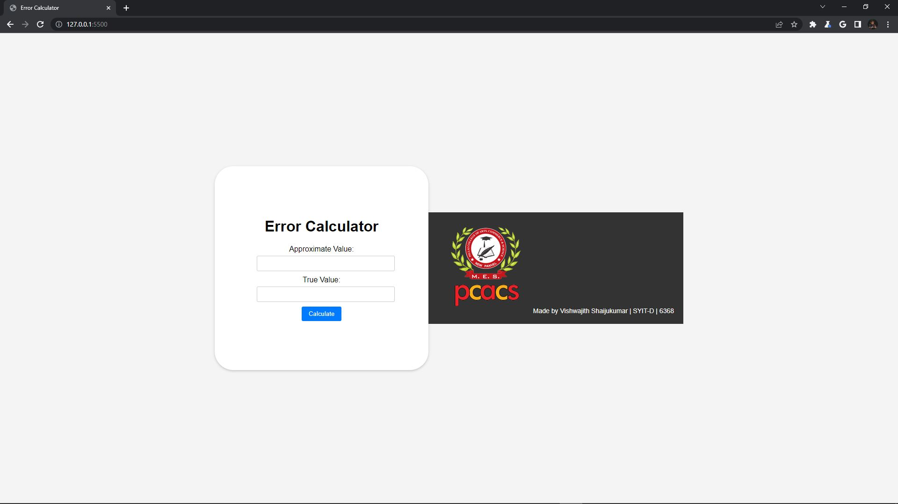
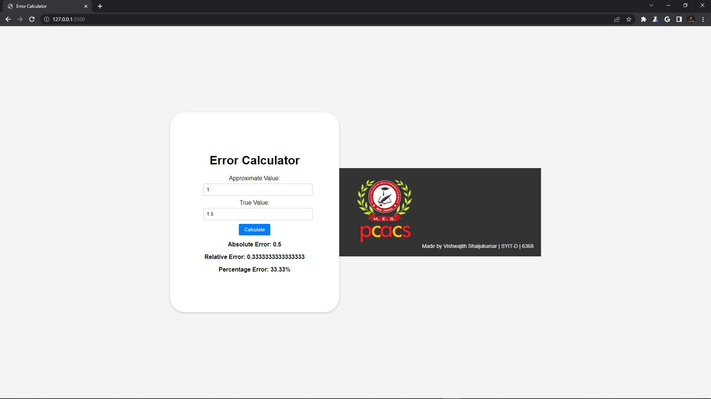

# Error Calculator Web App🗿🧮

Welcome to the Error Calculator Web App! This is a simple web application that takes two input values and calculates their absolute error, relative error, and percentage error. This README will guide you through the project, its features, and how to set it up.

## Before

## After

## Features

- Calculate Absolute Error
- Calculate Relative Error
- Calculate Percentage Error
- User-friendly interface

## 🎈

## Installation and Setup

1. Clone the repository: `git clone https://github.com/root-cyborg127/Error_Approximation.git`
2. Navigate to the project directory: `cd Error_Approximation`
3. Open `index.html` in your web browser

## Usage

1. Enter the approximate value and true value in the input fields.
2. Click the "Calculate" button to see the error values.
3. Results will be displayed in separate containers with bold text.

## Customization

- Feel free to modify the colors, fonts, and styling in the `styles.css` file to match your preferences.
- 

## Contributing

Contributions are welcome! If you find any issues or have suggestions for improvements, please feel free to open an issue or create a pull request.

## License

This project is licensed under the [MIT License](LICENSE).

---

Made by Vishwajith Shaijukumar | SYIT-D | 6368
